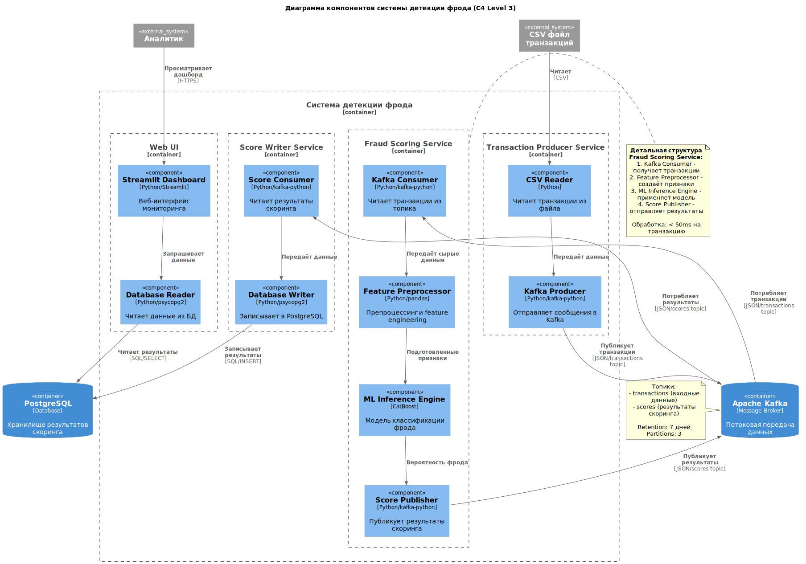

# Fraud Detection MLOps Pipeline

Проект развивает решение из Семинара 3: вместо пакетной обработки CSV внедрён полноценный потоковый конвейер Kafka → модель → Kafka → Postgres → Streamlit. Все сервисы поднимаются `docker-compose`, модель CatBoost используется только для инференса (CPU).

## Архитектура системы

Система спроектирована с использованием методологии **C4 (Context, Containers, Components, Code)** для визуализации архитектуры на разных уровнях детализации.

### Диаграммы

#### Контекстная диаграмма (C4 Level 1)

Показывает систему детекции фрода как единое целое и её взаимодействие с внешними акторами (аналитики, платёжные системы, мониторинг).


[ Открыть в полном размере](docs/architecture/context-diagram.svg) | [ PlantUML источник](docs/architecture/context-diagram.puml)

---

#### Диаграмма компонентов (C4 Level 3)

Детализирует внутреннюю структуру системы, включая микросервисы (Transaction Producer, Fraud Scoring Service, Score Writer, Web UI) и их компоненты. Особое внимание уделено детализации **Fraud Scoring Service** с описанием потока данных: Kafka Consumer → Feature Preprocessor → ML Inference Engine → Score Publisher.



[ Открыть в полном размере](docs/architecture/component-diagram.svg) | [ PlantUML источник](docs/architecture/component-diagram.puml)

---

### Документация

- **[Пояснительная записка](docs/architecture/architecture.md)** — подробное описание архитектуры, потоков данных, паттернов проектирования, масштабирования и рекомендаций по развёртыванию.
- **[Полная архитектурная документация](docs/architecture/)** — все диаграммы и документы в одном месте.

### Основные компоненты системы

1. **Apache Kafka** — message broker для потоковой передачи данных (топики: `transactions`, `scores`)
2. **Fraud Scoring Service** — сервис ML-инференса с CatBoost моделью
3. **PostgreSQL** — хранилище результатов скоринга
4. **Streamlit Dashboard** — веб-интерфейс для мониторинга фрода

**Производительность**: 1000+ транзакций/сек, латентность < 100ms

## Быстрый старт (Docker Compose)

1. Поместите файл с транзакциями (формат как у `test.csv` соревнования) в каталог `input/test.csv`.
2. Убедитесь, что в `artifacts/` лежат файлы модели: `catboost_model.cbm` и `feature_metadata.json`. Их можно получить командой обучения из раздела ниже.
3. Запустите весь стек:
   ```bash
   docker compose up --build
   ```
4. После старта сервисов:
   - Kafka (`transactions` → `scores`) получает сообщения от генератора.
   - `fraud-scorer` читает входной топик, препроцессит данные и пишет результаты скоринга.
   - `score-writer` выгружает топик `scores` в PostgreSQL (`transaction_scores`).
   - Streamlit доступен по адресу http://localhost:8501 — нажмите «Посмотреть результаты», чтобы увидеть 10 последних подозрительных транзакций и гистограмму распределения скорингов последних 100 записей.

> Если нужен один прогон без повторной отправки сообщений, запустите `docker compose up` с переменной `PRODUCER_REPEAT=false` для сервиса `transaction-producer`.

### Сервисы docker-compose

| Сервис               | Назначение                                                                    |
|----------------------|--------------------------------------------------------------------------------|
| `kafka`              | Kafka в режиме KRaft с автосозданием топиков                                   |
| `transaction-producer` | Читает `input/test.csv`, отправляет транзакции в топик `transactions`         |
| `fraud-scorer`       | Сервис инференса: потребляет из Kafka, применяет CatBoost, пишет в `scores`    |
| `score-writer`       | Потребляет `scores`, складывает результаты в PostgreSQL                        |
| `postgres`           | Хранит витрину `transaction_scores`                                            |
| `streamlit-ui`       | Простое UI (Streamlit) с таблицей фродов и гистограммой                       |

## Структура репозитория

- `streaming/` — код потоковых сервисов:
  - `transaction_producer.py` — генерация событий в Kafka.
  - `inference_service.py` — потребитель входного топика, скоринг, публикация результатов.
  - `score_writer.py` — синк в PostgreSQL.
  - `ui_app.py` — Streamlit-дэшборд.
  - `config.py`, `kafka_utils.py`, `predictor.py` — общие настройки и утилиты.
- `source/train/preprocess_data.py` — препроцессинг, общий для обучения и инференса.
- `source/train/train.py` — обучение модели CatBoost, сохранение артефактов.
- `inference.py` — пакетный инференс из предыдущего задания (остаётся для офлайн-проверок).
- `Dockerfile`, `docker-compose.yml`, `requirements.txt` — упаковка и запуск.
- `artifacts/` — модель (`catboost_model.cbm`) и метаданные (`feature_metadata.json`).

## Локальное окружение

```bash
python3 -m venv .venv
source .venv/bin/activate
pip install -r requirements.txt
```

### Предобработка данных

```bash
python source/train/preprocess_data.py \
  --input-path source/data/train.csv \
  --output-path artifacts/train_features.parquet
```

Скрипт повторяет всю логику фичеинжиниринга, использующуюся при обучении и инференсе. Параметр `--output-path` опционален: без него файл не сохраняется, но в консоль выводится форма и список колонок.

### Обучение модели

```bash
python source/train/train.py \
  --train-path source/data/train.csv \
  --model-path artifacts/catboost_model.cbm \
  --metrics-path artifacts/metrics.json \
  --metadata-path artifacts/feature_metadata.json \
  --validation-size 0.25 \
  --split-strategy random
```

По умолчанию используется стратифицированный случайный сплит 20% (`--split-strategy random`, `--validation-size 0.2`). Для воспроизведения хронологического hold-out укажите `--split-strategy time` и подходящую долю валидации, как в примере выше.

Скрипт сохранит:
- модель CatBoost (`artifacts/catboost_model.cbm`);
- JSON с метриками валидации (`artifacts/metrics.json`);
- описание признаков и рекомендованный порог классификации (`artifacts/feature_metadata.json`).

### Локальный инференс

```bash
python inference.py \
  --input-dir source/data \
  --output-dir output \
  --model-path artifacts/catboost_model.cbm \
  --metadata-path artifacts/feature_metadata.json
```

На выходе в каталоге `output/` появятся:
- `sample_submission.csv` — предсказания в формате Kaggle;
- `feature_importances.json` — top-5 наиболее важных признаков;
- `prediction_density.png` — график плотности распределения предсказанных вероятностей.

> Порог для перевода вероятностей в метки и порядок колонок берутся из `artifacts/feature_metadata.json`. При необходимости можно переопределить его через `--threshold`, а также изменить имена входного и выходного файлов соответствующими аргументами CLI.

## Docker

1. Собрать образ:
   ```bash
   docker build -t fraud-inference .
   ```
2. Подготовить директории:
   ```bash
   mkdir -p input output
   cp source/data/test.csv input/
   ```
3. Запустить контейнер:
   ```bash
   docker run --rm \
     -v "$(pwd)/input":/app/input \
     -v "$(pwd)/output":/app/output \
     fraud-inference
   ```
   После выполнения в `output/` появятся все артефакты инференса.

> **Важно:** перед сборкой Docker-образа убедитесь, что обученная модель и метаданные сохранены в `artifacts/`.

## Тестирование потока вручную

- Отправка единичных сообщений:
  ```bash
  python streaming/transaction_producer.py
  ```
- Проверка содержимого топиков:
  ```bash
  docker compose exec kafka kafka-console-consumer.sh \
    --bootstrap-server kafka:9092 \
    --topic scores \
    --from-beginning
  ```
- Просмотр сохранённых значений:
  ```bash
  docker compose exec postgres psql \
    -U fraud -d fraud -c "SELECT * FROM transaction_scores LIMIT 5;"
  ```

Все команды выше предполагают, что стек поднят через `docker compose up`.
